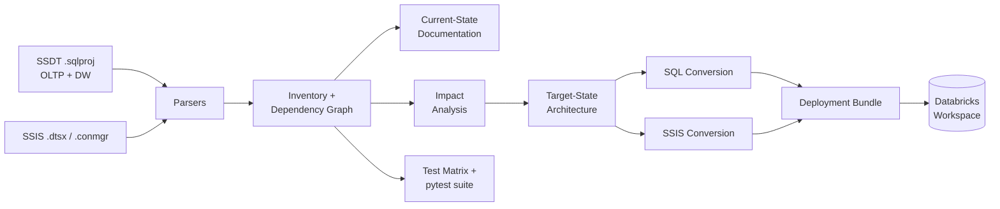
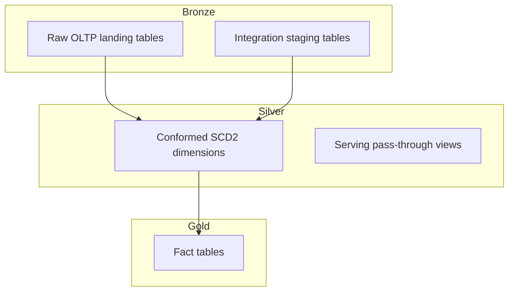

# sql-ssis-to-databricks-accelerator

**Analyse, document, and convert SQL Server/Synapse + SSIS solutions into deployable Databricks (Unity Catalog, Delta Lake, Workflows) assets.**

[](LICENSE)
[](pyproject.toml)

---

## What this accelerator does

This is a static-analysis-driven modernisation accelerator. Point it at a
SQL Server/Azure Synapse database project (SSDT) plus an SSIS ETL solution,
and it produces, in order:

1. **Inventory & dependency graph** — every table, view, procedure,
   function, and SSIS task, classified and linked into a dependency DAG.
2. **Current-state documentation** — an executive summary and technical
   deep dive, generated from the inventory, not hand-written.
3. **Impact analysis** — a 12-dimension risk score per object (SQL dialect,
   procedural complexity, SSIS control/data flow, data type risk,
   performance risk, security model change, etc.) and a lift-and-shift /
   partial-automation / rewrite-required / manual-redesign classification.
4. **Target-state architecture** — a medallion (Bronze/Silver/Gold) design
   with Unity Catalog naming, file layout, and orchestration mapping —
   defaulted, but overridable (see below).
5. **Converted SQL and PySpark assets** — tables, views, procedures, and
   functions converted to Databricks SQL or PySpark, with every unresolved
   construct explicitly flagged rather than silently guessed at.
6. **Converted SSIS orchestration** — the SSIS package's control flow, data
   flow, variables, and connection managers mapped to a Databricks Workflow
   job spec and Asset Bundle.
7. **Test matrix and automated tests** — a scenario-driven test matrix plus
   a real pytest suite covering parsers, converters, and architecture
   recommendations, including snapshot tests against golden output.
8. **Deployment artifacts** — a complete Databricks Asset Bundle, per-
   environment config, and deploy/promote/rollback tooling.

Every step is driven by **real parsed source DDL**, not templates filled in
with assumptions — where the source uses a construct with no clean
Databricks equivalent (a `CURSOR`, `OPENJSON`, a SQL Server temporal table
query), the accelerator says so explicitly rather than emitting plausible-
looking but wrong code.

This repository ships with the included scripts run end-to-end against the
[Wide World Importers sample](https://github.com/microsoft/sql-server-samples/tree/master/samples/databases/wide-world-importers)
as a worked example — see `docs/example-run/` for the actual generated
output of a full run, including an adversarial review of its own
correctness (`docs/example-run/adversarial_review.md`).

This entire accelerator — every module under `accelerator/`, the deployment
tooling, the test suite — was built from a single, ordered sequence of
prompts against this sample corpus. That sequence is preserved verbatim in
[`docs/runbook/RUNBOOK.md`](docs/runbook/RUNBOOK.md): reuse it to rebuild or
extend the accelerator from a fresh session, or to point the same process at
a different source repo.

## Pipeline



## Target architecture: medallion on Unity Catalog



One catalog per environment (`wwi_dev` / `wwi_test` / `wwi_prod`), one
schema per layer (`bronze` / `silver` / `gold` / `ops`), Delta tables
throughout, Databricks Workflows for orchestration. Full rationale and
tradeoffs for every design decision are in the generated
`target_state_architecture.md` (see `docs/example-run/` for a worked copy,
or generate your own — see Quickstart).

## Supported source objects

| Category | Support |
|---|---|
| Tables (incl. temporal, memory-optimized, columnstore) | ✅ Parsed, classified, converted to Delta DDL with explicit risk flags |
| Views | ✅ Converted to Databricks SQL views; unsupported constructs (`FOR JSON`, `PIVOT`, `OPENROWSET`) flagged, not guessed |
| Materialized / indexed views | ⚠️ Detection logic present; no instance in the bundled sample corpus to validate against — see [Known Limitations](#known-limitations) |
| Stored procedures (set-based) | ✅ Converted to Databricks SQL |
| Stored procedures (procedural: `CURSOR`, `WHILE`, dynamic SQL, `OPENJSON`) | ✅ Detected and routed to PySpark stubs with the original T-SQL preserved for manual completion; orchestration-heavy procedures are split into SQL logic + Workflow orchestration |
| Scalar functions / inline & multi-statement TVFs | ✅ Simple functions → Databricks SQL UDF; procedural functions → PySpark, registered as a SQL-callable UDF via `spark.udf.register` |
| Sequences | ✅ Detected; mapped to `GENERATED ALWAYS AS IDENTITY` guidance rather than ported as data objects |
| SSIS packages, sequence containers, Execute SQL tasks, Data Flow tasks, expressions, precedence constraints, connection managers, variables | ✅ Parsed and mapped to Databricks Workflow tasks/parameters |
| SSIS Foreach Loop, flat-file connections, event handlers, expression-based branching | ⚠️ Mapping rules documented; no instance in the bundled sample to validate against |

## Prerequisites

- Python 3.10+
- No third-party packages required to run the analysis/conversion pipeline
  (pure standard library by design — see `pyproject.toml`)
- `pytest` to run the test suite (`pip install -r requirements.txt`)
- A local clone of a SQL Server/Synapse SSDT project + SSIS solution to
  analyse (the quickstart below uses the public Wide World Importers sample)
- For actual deployment: a Databricks workspace with Unity Catalog enabled,
  and the [Databricks CLI](https://docs.databricks.com/dev-tools/cli/index.html) (`databricks bundle` support)

## Quickstart

```bash
# 1. Clone this repository
git clone https://github.com/<org>/sql-ssis-to-databricks-accelerator.git
cd sql-ssis-to-databricks-accelerator

# 2. Install test dependencies (the pipeline itself needs nothing extra)
pip install -r requirements.txt

# 3. Clone the sample source corpus (sparse checkout — just the WWI sample)
git clone --no-checkout https://github.com/microsoft/sql-server-samples.git ../sql-server-samples
cd ../sql-server-samples
git sparse-checkout init --cone
git sparse-checkout set samples/databases/wide-world-importers
git checkout main
cd ../sql-ssis-to-databricks-accelerator

# 4. Run the pipeline end-to-end
python run_analysis.py              # parse -> inventory -> dependency graph -> docs
python run_impact_analysis.py       # 12-dimension risk scoring + classification
python run_target_state_design.py   # medallion architecture + Unity Catalog design
python run_conversion.py            # convert SQL objects
python run_ssis_conversion.py       # convert the SSIS package
python run_test_matrix.py           # generate the test matrix

# 5. Run the test suite
pytest tests/

# 6. Run the full end-to-end validation (re-parses from scratch, runs
#    pytest, diffs golden snapshots, produces a pass/partial/fail report)
python run_validation.py
```

Generated analysis artifacts land in `outputs/`; converted code and the
SSIS Workflow spec land in `output/` (both gitignored — regenerate any time
by re-running the scripts above).

## Project structure

```
accelerator/                   Core library (no CLI — see run_*.py scripts below)
  parsers/
    sql_project_parser.py      Classifies .sql files (table/view/proc/function/etc.), scores complexity
    ssis_parser.py             Parses .dtsx packages and .conmgr connection managers
  analyzers/
    inventory_builder.py       Normalises parsed objects into the canonical inventory, assigns medallion layer/risk/confidence
    dependency_graph.py        Builds the dependency DAG, topological sort, cycle detection
    impact_analysis.py         12-dimension risk scoring and lift-and-shift/rewrite/manual classification
  converters/
    sql_converter.py           Table/view/function/procedure -> Databricks SQL or PySpark
    ssis_converter.py          SSIS package -> Databricks Workflow spec, connection/variable mapping
  docs/
    current_state_doc.py       Generates current-state documentation from the inventory
    target_state_design.py     Generates target-state architecture (medallion mapping, Unity Catalog design, orchestration mapping)
    test_matrix.py             Generates the scenario-driven test matrix

run_analysis.py                Step 1-4: parse, inventory, dependency graph, documentation
run_impact_analysis.py         Step 5: impact analysis
run_target_state_design.py     Step 6: target architecture
run_conversion.py              Step 7: SQL conversion
run_ssis_conversion.py         Step 8: SSIS conversion
run_test_matrix.py             Test matrix generation
run_validation.py              Full end-to-end validation against the real source repo

mcp/
  server.py                    MCP server exposing the accelerator as tools/resources/prompts
                                for AI agents (stdio transport) — see mcp/README.md
skills/                        One markdown prompt file per pipeline step — paste directly
                                into a fresh Claude Code session (see docs/runbook/RUNBOOK.md)

tests/                         pytest suite (parsers, metadata extraction, dependency graph,
                                SQL conversion, SSIS mapping, architecture recommendation,
                                deployment bundle, regression tests for known edge cases)
fixtures/                      Real WWI source excerpts used by the test suite
golden_outputs/                Snapshot files for deterministic conversion output

bundle/                        Databricks Asset Bundle (databricks.yml, resources/, src/)
conf/                          Per-environment parameters (dev.yml/test.yml/prod.yml) + secrets.md
deploy/                        Deploy/promote/rollback scripts and the bundle generator

docs/
  DEPLOYMENT.md                 Full deployment guide (folder structure, compute recommendation,
                                 idempotency, promotion, rollback)
  example-run/                  Output of a full run against the bundled WWI sample, including
                                 the adversarial review and end-to-end validation report
  runbook/
    RUNBOOK.md                  The actual prompt sequence used to build this accelerator,
                                 step by step — reuse it to rebuild/extend the accelerator
                                 against a different source corpus from a fresh session
```

## Overriding the target architecture

The default is medallion (Bronze/Silver/Gold) — `target_state_design.py`
evaluates it against Data Vault and One Big Table alternatives based on
signals detected in your source (SCD2 usage, staging layer presence,
conformed dimension/fact model) and documents why medallion won by default.
To override:

```python
from accelerator.docs.target_state_design import generate_target_state_design

generate_target_state_design(
    inventory, graph, complexity_scores, output_dir,
    architecture_override="data_vault",   # or "one_big_table"
)
```

Or from the command line:

```bash
python run_target_state_design.py data_vault
```

The override is always recorded in `target_state_mappings.json`'s
`architecture_decision` block — `chosen_architecture` and `is_default`
reflect exactly what was requested, and all three architectures' fit
evaluation is preserved regardless of which one is chosen, so the decision
stays auditable.

## Running tests

```bash
pytest tests/ -v                  # full suite
pytest tests/test_sql_conversion.py -v   # one module
REGENERATE_GOLDEN=1 pytest tests/test_sql_conversion.py   # after a deliberate, reviewed
                                                            # change to converter output format
```

See `pytest.ini` for markers (`slow`, `integration`, `regression`) and
`docs/example-run/test_report_template.md` for a fill-in-the-blanks test
run report template.

## Deploying to Databricks

Full guide: [`docs/DEPLOYMENT.md`](docs/DEPLOYMENT.md). Summary:

```bash
./deploy/deploy.sh dev        # test -> validate -> idempotent SQL DDL -> bundle deploy -> smoke test
./deploy/promote.sh dev test  # promote, with a pre-prod checklist gate for test->prod
```

Compute recommendation is Serverless throughout (SQL warehouse + notebook
tasks) — see `docs/DEPLOYMENT.md` for the rationale and when to reconsider.
Every generated table is idempotent (`CREATE TABLE IF NOT EXISTS`,
`CREATE OR REPLACE VIEW`, overwrite-mode/MERGE writes); rollback uses Delta
`RESTORE TABLE ... VERSION/TIMESTAMP AS OF` in reverse dependency order
(see `deploy/rollback.md`).

## Known limitations

- **No materialized/indexed views, SSIS Foreach Loops, flat-file
  connections, or event handlers in the bundled sample corpus** — mapping
  rules are documented for all of them, but none have been validated
  against a real instance. Treat that guidance as a starting point, not a
  battle-tested path, until exercised against a source repo that actually
  uses them.
- **Dynamic SQL (`sp_executesql`, dynamic `EXEC()`) is invisible to the
  static dependency graph** if present — none exists in the bundled sample,
  but if you point this accelerator at a source repo that uses dynamic SQL,
  audit dependency edges for that object manually.
- **Procedural extraction is regex-based, not a full T-SQL parser** —
  correctly extracts top-level DML for most cases, but deeply nested CURSOR
  loop bodies need manual verification. Objects with this profile are
  always routed to manual review, never silently trusted.
- **No live database connection is used anywhere** — this is a static
  analysis and code-generation accelerator. Generated deployment scripts
  (`deploy/sql_deploy.py`, `deploy/validate_deployment.py`) need
  `databricks-sql-connector` installed for live execution; the analysis/
  conversion pipeline itself never connects to anything.
- See `docs/example-run/adversarial_review.md` for a full adversarial
  self-review (hidden dependencies, naive-translation risks, variable
  scoping hazards, etc.) and `docs/example-run/remediation_backlog.csv` for
  what was found and fixed.

## Contributing

See [CONTRIBUTING.md](CONTRIBUTING.md) for how to add support for new SQL
Server object types, new SSIS task mappings, new test fixtures, and the
project's coding conventions.

## License

[MIT](LICENSE)
