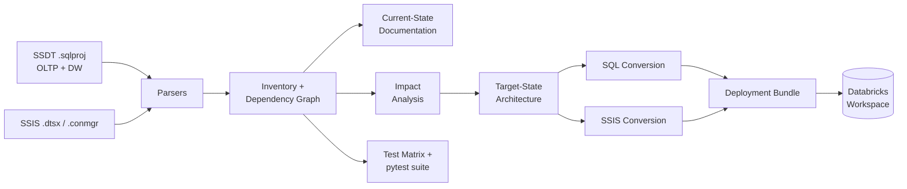
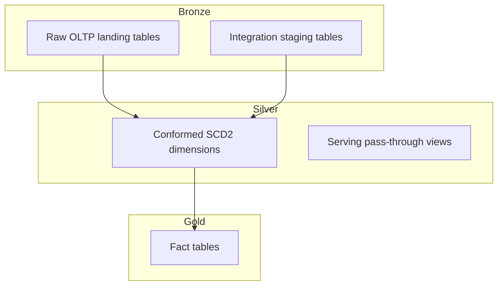

# sql-ssis-to-databricks-accelerator

**Analyse, document, and convert SQL Server/Synapse + SSIS solutions into deployable Databricks (Unity Catalog, Delta Lake, Workflows) assets.**

[](LICENSE)
[](pyproject.toml)

---

## Two ways to use this accelerator

This repository contains **two complementary tools** that work independently
or together. You don't need both — choose based on how you prefer to work.

---

### 1. Python pipeline — run it yourself, without an AI agent

A self-contained Python library and CLI that runs the full modernisation
pipeline locally. No AI agent required. No API key. Pure standard library
(Python 3.10+).

```
accelerator/        Core library: parsers, analyzers, converters, doc generators
run_*.py            CLI entry points, one per pipeline stage
accelerator/cli.py  Single-command orchestrator for the full pipeline
deploy/             Databricks Asset Bundle generator and deploy scripts
```

**When to use:** You want deterministic, repeatable output you can version-control,
run in CI, and review before deploying. The Python pipeline is the primary
deliverable — the AI layer (below) is built on top of it.

**Quickstart:**
```bash
git clone https://github.com/shivanandiyer/sql-ssis-to-databricks-accelerator
cd sql-ssis-to-databricks-accelerator
pip install -r requirements.txt
python accelerator/cli.py --source-path /path/to/your/sql-ssis-repo
```

Full guide: [`docs/USAGE.md`](docs/USAGE.md)

---

### 2. Claude AI layer — skills, MCP server, and prompt runbook

A set of tools for driving the modernisation work interactively through Claude
Code or another MCP-compatible AI agent. Built on top of the Python pipeline.

```
skills/             15 prompt files — paste into Claude Code to build or extend
                    the accelerator step by step, or run individual stages
mcp/                MCP server exposing all pipeline stages as AI-callable tools
docs/runbook/       The exact prompt sequence used to build this entire repo —
RUNBOOK.md          reusable against any new source repo from a fresh session
```

**When to use:** You want to drive the modernisation conversationally, have Claude
explain what it found, make judgment calls about ambiguous constructs, or extend
the accelerator to support new SQL Server patterns. The skills and MCP server
wrap the same Python pipeline — they don't replace it.

**Quickstart (Claude Code):**
```bash
# Start the MCP server so Claude Code can call pipeline tools directly
python mcp/server.py
```
Or paste any file from `skills/` directly into a Claude Code session.

Full guides: [`docs/SKILLS.md`](docs/SKILLS.md) | [`mcp/README.md`](mcp/README.md)

---

## Example outputs

Want to see what the pipeline actually produces before running it?

The [`docs/example-run/`](docs/example-run/) directory contains the **complete
output of a full pipeline run against the
[Wide World Importers sample corpus](https://github.com/microsoft/sql-server-samples/tree/master/samples/databases/wide-world-importers)**,
committed as a worked example:

- **[`docs/example-run/pipeline-outputs/`](docs/example-run/pipeline-outputs/)** — all analysis outputs: inventory, dependency graph, impact analysis, medallion mapping, target-state architecture, test matrix, risk register
- **[`docs/example-run/pipeline-converted/`](docs/example-run/pipeline-converted/)** — all conversion outputs: Databricks SQL DDL (one file per object, organised by layer), PySpark modules, Workflow spec, review-required items, conversion manifest
- **[`docs/example-run/`](docs/example-run/)** — validation summary, adversarial review, and remediation backlog

> These outputs were generated during initial testing and validation of this
> accelerator. When you run the pipeline against your own source repo, the
> outputs will reflect your actual codebase — object names, counts, converted
> SQL, and Workflow tasks will all differ from the WWI examples shown here.

---

## What the pipeline produces

Point either tool at a SQL Server/Azure Synapse database project (SSDT) plus
an SSIS ETL solution, and it produces, in order:

1. **Inventory & dependency graph** — every table, view, procedure,
   function, and SSIS task, classified and linked into a dependency DAG.
2. **Current-state documentation** — an executive summary and technical
   deep dive, generated from the inventory, not hand-written.
3. **Impact analysis** — a 12-dimension risk score per object (SQL dialect,
   procedural complexity, SSIS control/data flow, data type risk,
   performance risk, security model change, etc.) and a lift-and-shift /
   partial-automation / rewrite-required / manual-redesign classification.
4. **Target-state architecture** — a medallion (Bronze/Silver/Gold) design
   with Unity Catalog naming, file layout, and orchestration mapping —
   defaulted, but overridable.
5. **Converted SQL and PySpark assets** — tables, views, procedures, and
   functions converted to Databricks SQL or PySpark, with every unresolved
   construct explicitly flagged rather than silently guessed at.
6. **Converted SSIS orchestration** — the SSIS package's control flow, data
   flow, variables, and connection managers mapped to a Databricks Workflow
   job spec and Asset Bundle.
7. **Test matrix and automated tests** — a scenario-driven test matrix plus
   a real pytest suite covering parsers, converters, and architecture
   recommendations.
8. **Deployment artifacts** — a complete Databricks Asset Bundle, per-
   environment config, and deploy/promote/rollback tooling.

Every step is driven by **real parsed source DDL**, not templates filled in
with assumptions — where the source uses a construct with no clean
Databricks equivalent (a `CURSOR`, `OPENJSON`, a SQL Server temporal table
query), the accelerator flags it explicitly rather than emitting plausible-
looking but wrong code.

---

## Pipeline



## Target architecture: medallion on Unity Catalog



One catalog per environment, one schema per layer (`bronze` / `silver` / `gold` / `ops`),
Delta tables throughout, Databricks Workflows for orchestration. Full rationale and
tradeoffs for every design decision are in the generated `target_state_architecture.md`
(see `docs/example-run/` for a worked copy, or generate your own).

---

## Supported source objects

| Category | Support |
|---|---|
| Tables (incl. temporal, memory-optimized, columnstore) | ✅ Parsed, classified, converted to Delta DDL with explicit risk flags |
| Views | ✅ Converted to Databricks SQL views; unsupported constructs (`FOR JSON`, `PIVOT`, `OPENROWSET`) flagged, not guessed |
| Materialized / indexed views | ⚠️ Detection logic present; no instance in the bundled sample corpus to validate against |
| Stored procedures (set-based) | ✅ Converted to Databricks SQL |
| Stored procedures (procedural: `CURSOR`, `WHILE`, dynamic SQL, `OPENJSON`) | ✅ Detected and routed to PySpark stubs with the original T-SQL preserved for manual completion |
| Scalar functions / inline & multi-statement TVFs | ✅ Simple functions → Databricks SQL UDF; procedural functions → PySpark |
| Sequences | ✅ Detected; mapped to `GENERATED ALWAYS AS IDENTITY` guidance |
| SSIS packages, sequence containers, Execute SQL tasks, Data Flow tasks, expressions, precedence constraints, connection managers, variables | ✅ Parsed and mapped to Databricks Workflow tasks/parameters |
| SSIS Foreach Loop, flat-file connections, event handlers, expression-based branching | ⚠️ Mapping rules documented; no instance in the bundled sample to validate against |

---

## Prerequisites

- Python 3.10+
- No third-party packages required to run the analysis/conversion pipeline
  (pure standard library by design — see `pyproject.toml`)
- `pytest` to run the test suite (`pip install -r requirements.txt`)
- A local clone of a SQL Server/Synapse SSDT project + SSIS solution to analyse
- For actual deployment: a Databricks workspace with Unity Catalog enabled,
  and the [Databricks CLI](https://docs.databricks.com/dev-tools/cli/index.html)

---

## Quickstart

### Option 1: Python pipeline (no AI agent)

```bash
# 1. Clone this repository
git clone https://github.com/shivanandiyer/sql-ssis-to-databricks-accelerator
cd sql-ssis-to-databricks-accelerator

# 2. Install dependencies
pip install -r requirements.txt

# 3. Run the full pipeline against your repo (auto-detects OLTP/DW/SSIS dirs)
python accelerator/cli.py --source-path /path/to/your/sql-ssis-repo

# Or with explicit directory paths:
python accelerator/cli.py \
    --oltp-dir  /path/to/repo/OLTP_Project \
    --dw-dir    /path/to/repo/DataWarehouse \
    --ssis-dir  /path/to/repo/ETL_Packages
```

See [`docs/USAGE.md`](docs/USAGE.md) for the full guide: skip flags,
custom output directories, architecture overrides, and what to do with
the `review_required/` items.

### Option 2: Claude AI layer (MCP server)

```bash
# Start the MCP server — exposes all pipeline stages as tools for Claude
python mcp/server.py
```

Then configure Claude Desktop or Claude Code to connect (see [`mcp/README.md`](mcp/README.md)).
Once connected, you can run pipeline stages, ask Claude to explain findings,
and get guided through review items conversationally.

### Option 3: Claude skills (prompt-driven)

Open Claude Code in the repo directory and paste any file from `skills/`:

```bash
# Example: paste this to re-run the SQL conversion stage
cat skills/05_convert_sql_objects.md | pbcopy   # then paste into Claude Code
```

Or use the skills to rebuild the accelerator from scratch against a new corpus —
paste them in order (00 → 01 → 02 → … → 13). See [`docs/SKILLS.md`](docs/SKILLS.md).

### Against the Wide World Importers sample corpus

```bash
# Clone the sample (sparse checkout — only the WWI database folder)
git clone --no-checkout https://github.com/microsoft/sql-server-samples.git ../sql-server-samples
cd ../sql-server-samples
git sparse-checkout init --cone
git sparse-checkout set samples/databases/wide-world-importers
git checkout main
cd ../sql-ssis-to-databricks-accelerator

# Run the full pipeline
python accelerator/cli.py \
    --oltp-dir ../sql-server-samples/samples/databases/wide-world-importers/wwi-ssdt/wwi-ssdt \
    --dw-dir   ../sql-server-samples/samples/databases/wide-world-importers/wwi-dw-ssdt/wwi-dw-ssdt \
    --ssis-dir ../sql-server-samples/samples/databases/wide-world-importers/wwi-ssis/wwi-ssis

# Run the test suite
pytest tests/

# Full end-to-end validation (re-parses, runs pytest, diffs golden snapshots)
python run_validation.py \
    --oltp-dir ../sql-server-samples/samples/databases/wide-world-importers/wwi-ssdt/wwi-ssdt \
    --dw-dir   ../sql-server-samples/samples/databases/wide-world-importers/wwi-dw-ssdt/wwi-dw-ssdt \
    --ssis-dir ../sql-server-samples/samples/databases/wide-world-importers/wwi-ssis/wwi-ssis
```

Generated analysis artifacts land in `outputs/`; converted code and the
SSIS Workflow spec land in `output/` (both gitignored — regenerate any time).

---

## Project structure

```
── Python pipeline ──────────────────────────────────────────────────────────

accelerator/                   Core library
  parsers/
    sql_project_parser.py      Classifies .sql files (table/view/proc/function/etc.)
    ssis_parser.py             Parses .dtsx packages and .conmgr connection managers
  analyzers/
    inventory_builder.py       Normalises parsed objects, assigns medallion layer/risk/confidence
    dependency_graph.py        Builds the dependency DAG, topological sort, cycle detection
    impact_analysis.py         12-dimension risk scoring and conversion classification
  converters/
    sql_converter.py           Table/view/function/procedure → Databricks SQL or PySpark
    ssis_converter.py          SSIS package → Databricks Workflow spec
  docs/
    current_state_doc.py       Generates current-state documentation
    target_state_design.py     Generates target-state architecture + medallion mapping
    test_matrix.py             Generates the scenario-driven test matrix

accelerator/cli.py             Single-command orchestrator (runs all 6 stages)
run_analysis.py                Stage 1–4: parse, inventory, dependency graph, docs
run_impact_analysis.py         Stage 5: impact analysis
run_target_state_design.py     Stage 6: target architecture
run_conversion.py              Stage 7: SQL conversion
run_ssis_conversion.py         Stage 8: SSIS conversion
run_test_matrix.py             Test matrix generation
run_validation.py              Full end-to-end validation

deploy/                        Bundle generator, deploy/promote/rollback scripts
bundle/                        Databricks Asset Bundle (databricks.yml, resources/, src/)
conf/                          Per-environment config (dev.yml / test.yml / prod.yml)

tests/                         pytest suite
fixtures/                      SQL source excerpts used by the test suite
golden_outputs/                Snapshot files for deterministic converter output

── Claude AI layer ──────────────────────────────────────────────────────────

mcp/
  server.py                    MCP server (stdio transport) — exposes all pipeline
                               stages as tools for Claude Desktop / Claude Code
  tools/                       One module per pipeline stage, callable via MCP
  README.md                    MCP configuration and tool usage guide

skills/                        15 prompt files — paste into Claude Code to build or
  00_overview.md               extend the accelerator, or re-run individual stages
  01_set_role_and_rules.md
  02_runtime_input_interface.md
  ...
  14_architecture_override.md

── Documentation ─────────────────────────────────────────────────────────────

docs/
  USAGE.md                     Full usage guide for the Python pipeline
  SKILLS.md                    Guide for using the Claude skills standalone
  DEPLOYMENT.md                Deployment guide (promote, rollback, compute config)
  example-run/                 Output of a full run against the WWI sample, including
                               adversarial review and validation report
  runbook/
    RUNBOOK.md                 The prompt sequence used to build this accelerator —
                               reuse it to rebuild/extend against any source corpus
```

---

## Overriding the target architecture

The default is medallion (Bronze/Silver/Gold). To use a different pattern:

```bash
python accelerator/cli.py --source-path /path/to/repo --architecture lakehouse
# Options: medallion (default) | lakehouse | lambda | kappa
```

Or per-stage:

```bash
python run_target_state_design.py --input-path ./outputs --architecture lakehouse
```

The override is always recorded in `target_state_mappings.json`'s
`architecture_decision` block so the decision stays auditable.

---

## Running tests

```bash
pytest tests/ -v                  # full suite
pytest tests/test_sql_conversion.py -v   # one module
REGENERATE_GOLDEN=1 pytest tests/test_sql_conversion.py   # regenerate snapshots after
                                                            # a deliberate converter change
```

---

## Deploying to Databricks

Full guide: [`docs/DEPLOYMENT.md`](docs/DEPLOYMENT.md). Summary:

```bash
./deploy/deploy.sh dev        # validate → deploy → smoke test
./deploy/promote.sh dev test  # promote with pre-prod checklist gate
```

Every generated table is idempotent (`CREATE TABLE IF NOT EXISTS`,
`CREATE OR REPLACE VIEW`); rollback uses Delta `RESTORE TABLE ... AS OF`
in reverse dependency order.

---

## Known limitations

- **No materialized/indexed views, SSIS Foreach Loops, flat-file
  connections, or event handlers in the bundled sample corpus** — mapping
  rules are documented, but none have been validated against a real instance.
- **Dynamic SQL (`sp_executesql`, dynamic `EXEC()`) is invisible to the
  static dependency graph** — audit dependency edges for any object that
  uses dynamic SQL manually.
- **Procedural extraction is regex-based, not a full T-SQL parser** —
  correctly extracts top-level DML for most cases, but deeply nested CURSOR
  loop bodies need manual verification. These objects are always routed to
  manual review, never silently trusted.
- **No live database connection is used anywhere** — this is a static
  analysis and code-generation accelerator.
- See `docs/example-run/adversarial_review.md` for a full adversarial
  self-review and `docs/example-run/remediation_backlog.csv` for what was
  found and fixed.

---

## Contributing

See [CONTRIBUTING.md](CONTRIBUTING.md) for how to add support for new SQL
Server object types, new SSIS task mappings, and new test fixtures.

## License

[MIT](LICENSE)
