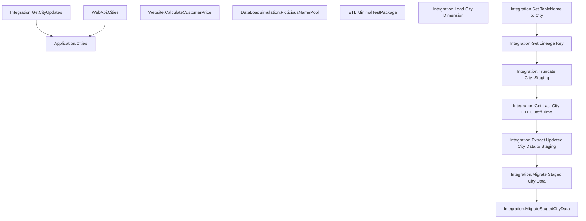

```mermaid
flowchart TD
  OLTP_Integration_GetCityUpdates["Integration.GetCityUpdates"]
  OLTP_WebApi_Cities["WebApi.Cities"]
  OLTP_Application_Cities["Application.Cities"]
  OLTP_Website_CalculateCustomerPrice["Website.CalculateCustomerPrice"]
  OLTP_Integration_MigrateStagedCityData["Integration.MigrateStagedCityData"]
  OLTP_DataLoadSimulation_FicticiousNamePool["DataLoadSimulation.FicticiousNamePool"]
  SSIS_MinimalTestPackage["ETL.MinimalTestPackage"]
  SSIS_MinimalTestPackage_Load_City_Dimension["Integration.Load City Dimension"]
  SSIS_MinimalTestPackage_Extract_Updated_City_Data_to_Staging["Integration.Extract Updated City Data to Staging"]
  SSIS_MinimalTestPackage_Get_Last_City_ETL_Cutoff_Time["Integration.Get Last City ETL Cutoff Time"]
  SSIS_MinimalTestPackage_Get_Lineage_Key["Integration.Get Lineage Key"]
  SSIS_MinimalTestPackage_Migrate_Staged_City_Data["Integration.Migrate Staged City Data"]
  SSIS_MinimalTestPackage_Set_TableName_to_City["Integration.Set TableName to City"]
  SSIS_MinimalTestPackage_Truncate_City_Staging["Integration.Truncate City_Staging"]
  OLTP_Integration_GetCityUpdates --> OLTP_Application_Cities
  OLTP_WebApi_Cities --> OLTP_Application_Cities
  SSIS_MinimalTestPackage_Truncate_City_Staging --> SSIS_MinimalTestPackage_Get_Last_City_ETL_Cutoff_Time
  SSIS_MinimalTestPackage_Get_Last_City_ETL_Cutoff_Time --> SSIS_MinimalTestPackage_Extract_Updated_City_Data_to_Staging
  SSIS_MinimalTestPackage_Set_TableName_to_City --> SSIS_MinimalTestPackage_Get_Lineage_Key
  SSIS_MinimalTestPackage_Extract_Updated_City_Data_to_Staging --> SSIS_MinimalTestPackage_Migrate_Staged_City_Data
  SSIS_MinimalTestPackage_Get_Lineage_Key --> SSIS_MinimalTestPackage_Truncate_City_Staging
  SSIS_MinimalTestPackage_Migrate_Staged_City_Data --> OLTP_Integration_MigrateStagedCityData
```